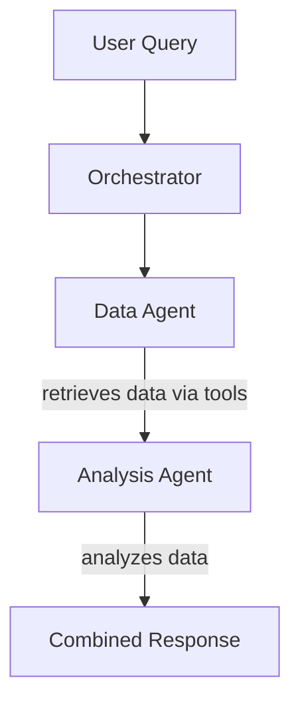

# Trading Assistant with LangChain, LangGraph & OpenBB API tools

An intelligent trading assistant powered by LangChain & LangGraph that integrates with OpenBB and Yahoo Finance for real-time market data. Supports multiple LLM providers: OpenAI, Google Gemini, Anthropic Claude, Perplexity, OpenRouter, and Ollama.

## Features

- 🤖 **Multi-LLM Support**: Choose between OpenAI, Google Gemini, Anthropic Claude, Perplexity, OpenRouter, or Ollama
- � **Multi-Agent System**: Separate data retrieval from analysis for better performance and clarity
- 📊 **Real-time Market Data**: Access stock quotes, historical data, news, and company profiles via OpenBB Tools (using Yahoo FInance & OECD as two main sources)
- 📈 **Economic Indicators**: Fetch GDP, CPI, and other economic data
- 💬 **Conversational Interface**: Natural language queries for financial data
- 🌟 **Commodity Mapping**: Automatic symbol resolution (Gold→XAU, Silver→XAG, etc.)

## Installation

### 1. Clone the Repository

In order to install the application, first make sure you have _git_, _conda_ installed.

Then, clone the source code from GitHub onto your local machine and navigate into the `Trading-Assistant` directory. Finally, use the provided `environment.yaml` file to create the _conda_ environment.

```bash
git clone https://github.com/samarthiith/Trading-Assistant
cd Trading-Assistant
```

### 2. Create Conda Environment

```bash
conda env create -f envs/environment.yaml
conda activate trading
```

### 3. Set Up Environment Variables

Copy the example environment file and add your API keys:

```bash
cp credentials/.env.example credentials/.env
```

Edit `.env` and add your API keys:

- **OpenAI**: https://platform.openai.com/api-keys
- **Google Gemini**: https://makersuite.google.com/app/apikey
- **Anthropic Claude**: https://platform.claude.com/docs/en/api/admin/api_keys/retrieve
- **Perplexity**: https://www.perplexity.ai/settings/api
- **OpenRouter**: https://openrouter.ai/keys

**Note**: Ollama runs locally and doesn't require an API key.

### 4. Set Up Model Config

Select the LLM model that you would like to us in the `config.yaml`.

## Usage

### 1. Basic Command-line (CLI) Usage

Run the agent:

```bash
python agent_system.py
```

You'll be prompted to choose between:

- **Two-Agent System**: Separate data retrieval and analysis

Example interaction with Two-Agent System:

```bash
🤖 Initializing Agent System with gemini...
✅ Agent System ready!
   📡 Data Agent: Fetches market data
   📊 Analysis Agent: Provides insights

You: What's the gold price trend?
[Agent processes with two-phase approach: data → analysis]

You: Get me the latest news about Tesla
[Agent retrieves TSLA news then analyzes sentiment]
```

### 2. Running the Streamlit Dashboard

To run the Streamlit dashboard:

```bash
streamlit run dashboard.py
```

The dashboard will open in your browser at `http://localhost:8501`. The app will enable you to interact in the chatbox.

In the sidebar, you can switch between:

- **Two-Agent System**: Separate data fetching and analysis

## Agent Modes

Modern architecture separating concerns:



**Benefits**:

- Clear separation between data and analysis
- Specialized prompts for each task
- Better debugging and transparency
- More accurate commodity symbol mapping

See [MULTI-AGENT_SYSTEM.md](docs/MULTI-AGENT_SYSTEM.md) for detailed documentation.

## License

AGPLv3 License
