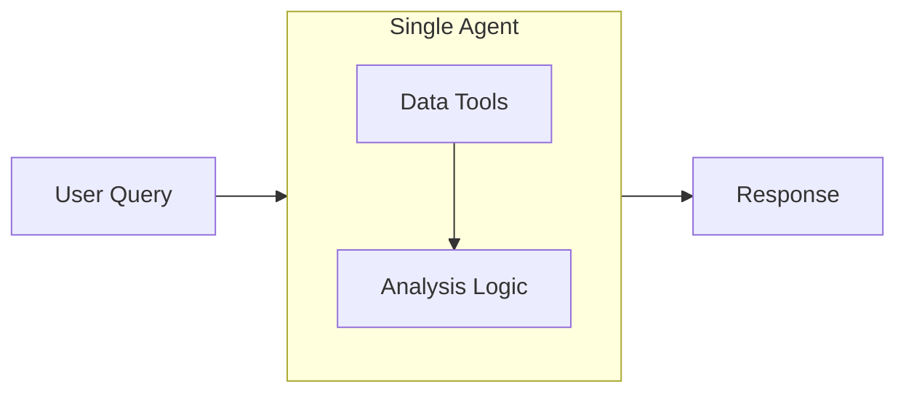
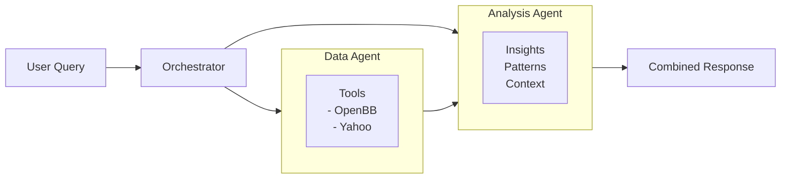

# Agent System Comparison

## Quick Reference Guide

### When to Use Each Mode

| Scenario | Single Agent | Two-Agent System |
|----------|--------------|------------------|
| Quick price lookup | ✅ Recommended | ⚪ Works but slower |
| Deep analysis needed | ⚪ Basic | ✅ Recommended |
| Debugging data issues | ❌ Hard to isolate | ✅ Easy to debug |
| Speed priority | ✅ Faster | ⚪ Slightly slower |
| Need data transparency | ⚪ Mixed output | ✅ Clear separation |
| Complex queries | ⚪ Can get confused | ✅ Better structured |
| Simple questions | ✅ Perfect | ⚪ Overkill |

-----------------------------------------------------

## Architecture Diagrams

### Single Agent Mode



### Two-Agent System



-----------------------------------------------------

## Response Format Comparison

### Single Agent Response

```txt
Here's the information about gold:

The current price of gold (XAU) is $2,123.45 per ounce, 
up 1.2% from yesterday. This represents a bullish trend 
with strong support at $2,100...
```

### Two-Agent System Response

```md
## 📊 Analysis Results

### Key Findings
- Current price: $2,123.45 (+1.2%)
- Support level: $2,100
- Resistance: $2,150

### Technical Analysis
The gold price shows bullish momentum with...

### Market Context
This increase aligns with...

---
📁 View Raw Data
[Expandable section with complete API response]
```

-----------------------------------------------------

## Example Use Cases

### Best for Single Agent

- "What's AAPL stock price?"
- "Show me TSLA quote"
- "Get current market indices"
- Simple data lookups

### Best for Two-Agent System

- "Analyze gold price trends over the past year"
- "Compare Apple and Microsoft financial performance"
- "What does the recent CPI data in Gemrany mean for markets?"

-----------------------------------------------------

## Migration Guide

### Switching from Single to Two-Agent

**Dashboard:**
Select "Two-Agent System" in sidebar radio button

**CLI:**
Just select option `2` when prompted
