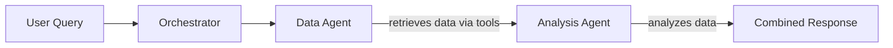

# Agent System Architecture

## Overview

The Trading Assistant supports **two-agent system**. The **two-agent system** separates concerns between data retrieval and analysis for better performance and clearer responsibilities.

---------------------------------------------------------

## Architecture

### 🤖🤖 Two-Agent System



---------------------------------------------------------

## Agents in the Two-Agent System

### 1. Data Agent (`agents/data_agent.py`)

**Purpose**: Fetch market data from APIs

**Responsibilities**:

- ✅ Retrieve requested data using tools
- ✅ Handle commodity symbol mapping (Gold→XAU, Silver→XAG, etc.)
- ✅ Return structured raw data
- ❌ NO analysis or insights

### 2. Analysis Agent (`agents/analysis_agent.py`)

**Purpose**: Analyze financial data and provide insights

**Responsibilities**:

- ✅ Analyze provided data
- ✅ Generate insights and interpretations
- ✅ Provide context and implications
- ❌ NO data fetching (no tools)

### 3. Orchestrator (`agents/orchestrator.py`)

**Purpose**: Coordinate workflow between agents

**Responsibilities**:

1. Receive user query
2. Route query to determine data needs
3. Data agent fetches data
4. Pass data to analysis agent
5. Combine and return results

---------------------------------------------------------

## Benefits of Two-Agent System

### 📊 When to Use

**Use Two-Agent System when**:

- Complex queries requiring deep analysis
- Want transparency in data vs. analysis
- Need to debug data retrieval issues
- Require detailed analytical insights

---------------------------------------------------------

## Example Workflows

### Query: "What is the gold price trend?"

#### Two-Agent System

```txt
1. Orchestrator routes query
2. Data Agent: Fetches XAU=F data via get_stock_data
3. Analysis Agent: Analyzes price trends, identifies patterns
4. Returns: Detailed analysis + raw data
```

---------------------------------------------------------

## File Structure

```txt
Trading-Assistant/
├── .github/prompts/           # default system prompts for agents
├── agent_system.py            # Main entry point
├── dashboard.py               # Streamlit UI
├── agents/
│   ├── __init__.py            # Module init
│   ├── data_agent.py          # Data retrieval agent
│   ├── analysis_agent.py      # Analysis agent
│   └── orchestrator.py        # Agent coordinator
├── tools/
│   └── openbb_tool.py         # OpenBB tools
└── utils/
    └── query_router.py        # Query routing & commodity mapping
```

---------------------------------------------------------

## Development

### Adding New Tools

Add tools to `data_agent.py` only:

```python
tools = [
    # existing tools...
    your_new_tool
]
```

### Modifying Analysis Logic

Edit prompts: you can edit the system prompts of each agent in `.github/prompts/`
