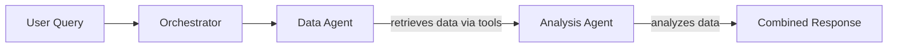

# Agent System Architecture

## Overview

The Trading Assistant supports **two-agent system**. The **two-agent system** separates concerns between data retrieval and analysis for better performance and clearer responsibilities.

---------------------------------------------------------

## Architecture

### 🤖🤖 Two-Agent System


```mermaid
graph LR
    A[User Query] --> B[Orchestrator]
    B --> C[Data Agent]
    C -->|retrieves data via tools| D[Analysis Agent]
    D -->|analyzes data| E[Combined Response]
```

---------------------------------------------------------

## Agents in the Two-Agent System

### 1. Data Agent (`skills/agents/data_agent.py`)

**Purpose**: Fetch market data from APIs

**Responsibilities**:

- ✅ Retrieve requested data using tools
- ✅ Handle commodity symbol mapping (Gold→XAU, Silver→XAG, etc.)
- ✅ Return structured raw data
- ❌ NO analysis or insights

### 2. Analysis Agent (`skills/agents/analysis_agent.py`)

**Purpose**: Analyze financial data and provide insights

**Responsibilities**:

- ✅ Analyze provided data
- ✅ Generate insights and interpretations
- ✅ Provide context and implications
- ❌ NO data fetching (no tools)

### 3. Orchestrator (`skills/agents/orchestrator.py`)

**Purpose**: Coordinate workflow between agents

**Responsibilities**:

1. Receive user query
2. Route query to determine data needs
3. Data agent fetches data
4. Pass data to analysis agent
5. Combine and return results

`LangGraphOrchestrator` (used by the app) is a LangGraph state graph: `route_query` → one tool node (`get_stock_data`, `get_economic_data`, `get_market_overview`) → `analysis` → `format`. It calls the OpenBB tools directly based on `skills/utils/query_router.py`. `TwoAgentOrchestrator` is the alternative that delegates data retrieval to the data agent.

---------------------------------------------------------

## Persistence (Neon Postgres)

Every query goes through `run_analysis` (`backend/db/service.py`). Database failures are logged and never block the answer.

| Storage | Purpose |
|---------|---------|
| `analysis_runs` | Each question and final answer, with status `pending` / `completed` / `failed` |
| `api_snapshots` | Raw data used for the analysis (provider, endpoint, symbol, payload) |
| `research_memories` | pgvector (384-dim, `all-MiniLM-L6-v2`) embeddings of completed analyses for semantic search |
| `user_preferences` | User settings (JSONB) |
| LangGraph checkpoints | Per-thread graph state via the Postgres checkpointer; falls back to in-memory if the DB is unreachable |
| `documents`, `document_chunks`, `chat_sessions`, `chat_messages` | Tables for document RAG and chat history (not yet written by the app) |

The checkpointer (thread state) and pgvector (cross-conversation semantic search) serve different purposes. Create the tables with `uv run python -m backend.db.init_db`.

---------------------------------------------------------

## Benefits of Two-Agent System

### 📊 When to Use

**Use Two-Agent System when**:

- Complex queries requiring deep analysis
- Want transparency in data vs. analysis
- Need to debug data retrieval issues
- Require detailed analytical insights

---------------------------------------------------------

## Example Workflows

### Query: "What is the gold price trend?"

#### Two-Agent System

```txt
1. Orchestrator routes query
2. Data Agent: Fetches XAU=F data via get_stock_data
3. Analysis Agent: Analyzes price trends, identifies patterns
4. Returns: Detailed analysis + raw data
```

---------------------------------------------------------

## File Structure

```txt
Trading-Assistant/
├── backend/
│   ├── agent_system.py        # CLI entry point + LLM setup
│   ├── api.py                 # FastAPI backend (/api/chat, /api/config, /api/docs)
│   └── db/                    # Neon Postgres layer
│       ├── connection.py      # Engine and LangGraph checkpointer
│       ├── models.py          # SQLAlchemy tables
│       ├── repository.py      # analysis_runs / api_snapshots access
│       ├── service.py         # run_analysis: run + persist
│       ├── memory.py          # research_memories add / search
│       ├── embeddings.py      # Embedding model
│       └── init_db.py         # Enable pgvector, create tables
├── frontend/                  # React UI (Vite)
└── skills/                    # AI components
    ├── prompts/               # default system prompts for agents
    ├── agents/
    │   ├── __init__.py        # Module init
    │   ├── data_agent.py      # Data retrieval agent
    │   ├── analysis_agent.py  # Analysis agent
    │   └── orchestrator.py    # Agent coordinator
    ├── tools/
    │   └── openbb_tool.py     # OpenBB tools
    └── utils/
        ├── query_router.py    # Query routing & commodity mapping
        └── settings.py        # Prompt loading, country resolution
```

---------------------------------------------------------

## Development

### Adding New Tools

Add the tool in `skills/tools/openbb_tool.py`, then:

- Data agent: add it to the `tools` list in `skills/agents/data_agent.py`.
- LangGraph orchestrator: add a tool node and routing entry in `skills/agents/orchestrator.py`, and teach `skills/utils/query_router.py` to suggest it.

```python
tools = [
    # existing tools...
    your_new_tool
]
```

### Modifying Analysis Logic

Edit the system prompts of each agent in `skills/prompts/`.
